# Dokumentasi Activity Diagram - Sistem Mockup Desain Sablon Baju

Dokumen ini berisi rancangan lengkap **Activity Diagram** berdasarkan *Use Case Diagram* untuk tiga aktor: **Customer**, **Admin**, dan **Owner**. Setiap diagram dilengkapi dengan penjelasan alur (Swimlane) dan representasi visual dalam format *Mermaid Flowchart*.

---

## 👨‍💻 AKTOR 1: CUSTOMER

### 1. Activity Diagram: Registrasi Akun
**Deskripsi Alur:**
*   **Customer:** Membuka halaman registrasi, mengisi form data diri (nama, email, password), dan menekan tombol daftar.
*   **Sistem:** Memvalidasi inputan. Jika data tidak valid (email sudah terdaftar/kosong), sistem menampilkan pesan error. Jika valid, sistem menyimpan data ke database dan mengarahkan pengguna ke halaman login.

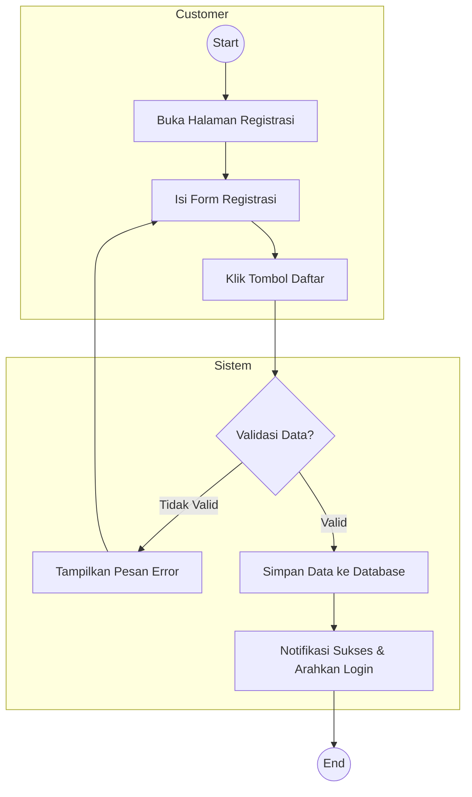

### 2. Activity Diagram: Membuat Desain Custom *(Include: Pilih Template Mentahan)*
**Deskripsi Alur:**
*   **Customer:** Membuka menu desain, memilih template baju mentahan, lalu memanipulasi desain (menambah teks/stiker) di kanvas, dan menyimpan hasil desain.
*   **Sistem:** Menampilkan pilihan template, memproses file desain (merender ukuran/posisi), memvalidasi kelengkapan, dan menyimpannya di database (tabel `Desain`).

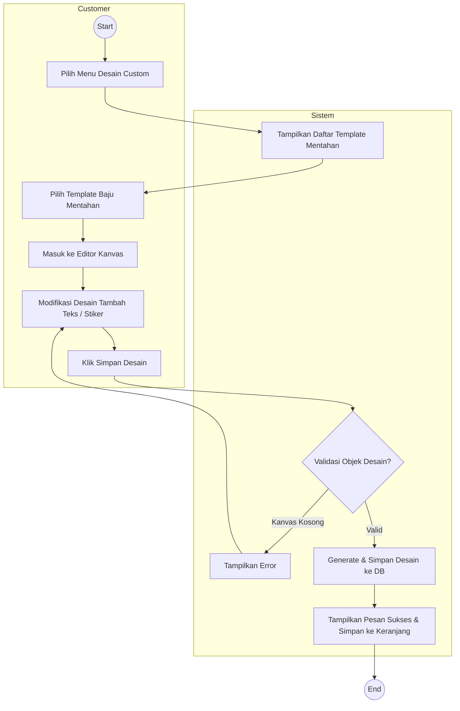

### 3. Activity Diagram: Kelola Keranjang *(Extend: Hapus Item Keranjang)*
**Deskripsi Alur:**
*   **Customer:** Membuka keranjang belanja, melihat daftar produk/desain. Customer dapat memilih untuk menghapus item (extend) atau lanjut ke *checkout*.
*   **Sistem:** Menampilkan data keranjang dari *session* atau database. Jika ada aksi hapus, sistem menghapus relasi dari tabel `Cart` dan merefresh tampilan keranjang.

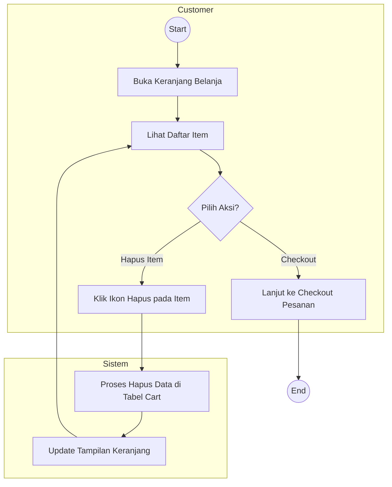

### 4. Activity Diagram: Checkout Pesanan *(Include: Lakukan Pembayaran)*
**Deskripsi Alur:**
*   **Customer:** Memulai proses checkout, memilih kurir, membuat pesanan, mentransfer uang, dan mengupload bukti pembayaran.
*   **Sistem:** Membuat rekam jejak pesanan (`Order`), mengkalkulasi total harga, dan menunggu file upload bukti transfer. Jika bukti valid, status pesanan menjadi `Menunggu Konfirmasi`.

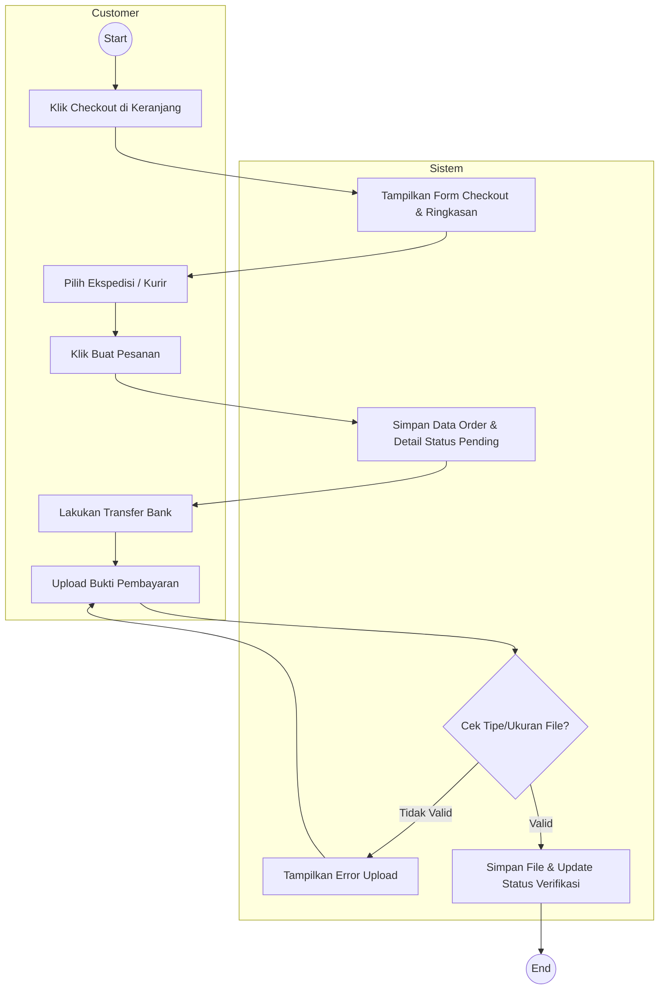

### 5. Activity Diagram: Lacak Pesanan
**Deskripsi Alur:**
*   **Customer:** Membuka menu riwayat transaksi, memilih salah satu transaksi untuk melihat pergerakan status (Pending, Diproses, Dikirim, Selesai).
*   **Sistem:** Mengambil data relasional `Order` dan mengembalikan view status pesanan terkini.

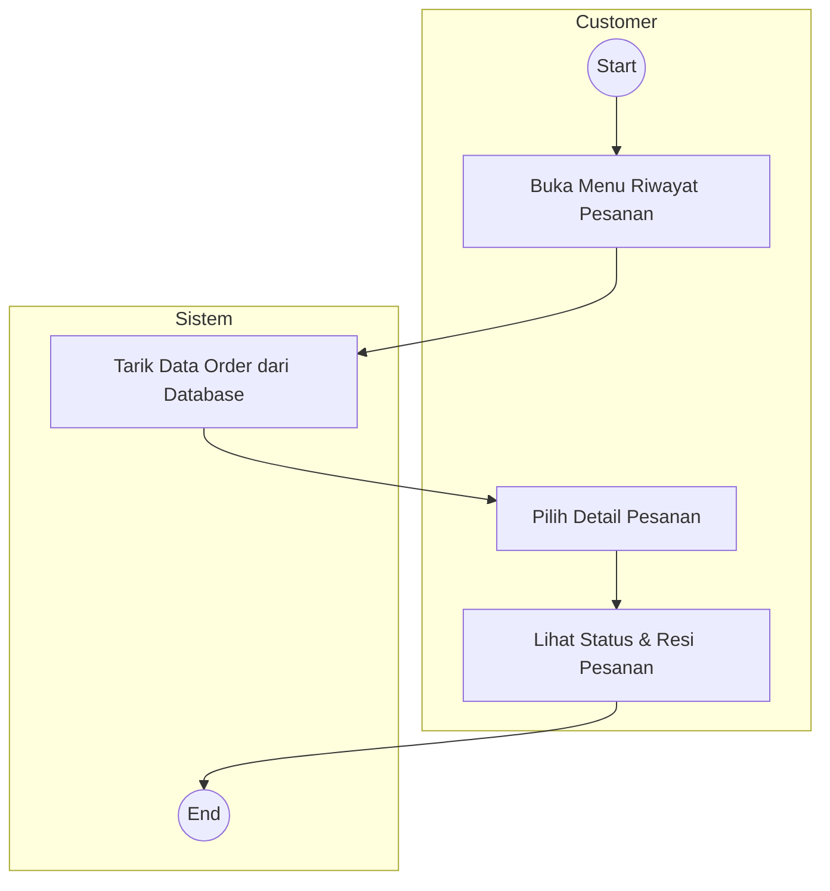

---

## 🛡️ AKTOR 2: ADMIN

### 6. Activity Diagram: Login (Umum untuk Semua Aktor)
**Deskripsi Alur:**
*   **Aktor:** Masuk ke halaman login, mengisi email dan password.
*   **Sistem:** Mengotentikasi ke database, memvalidasi role (Admin, Customer, Owner). Jika gagal, lempar kembali ke form login dengan alert error.

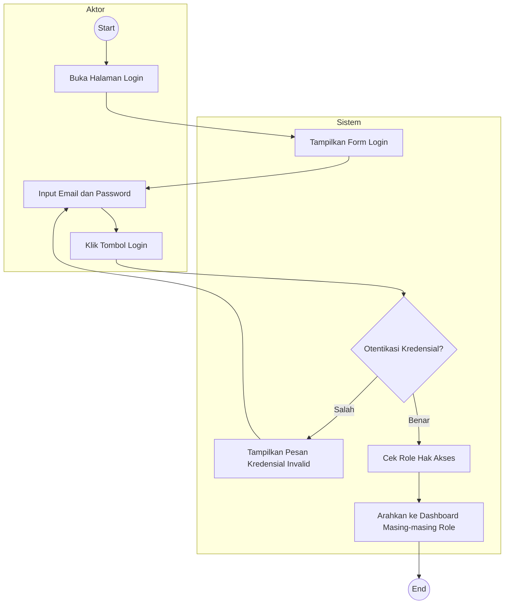

### 7. Activity Diagram: Kelola Data Produk
**Deskripsi Alur:**
*   **Admin:** Mengakses modul katalog produk, memiliki kapabilitas untuk *Create*, *Update*, atau *Delete* jenis sablon / barang.
*   **Sistem:** Merespon request CRUD dan memutakhirkan tabel `Produk` di database.

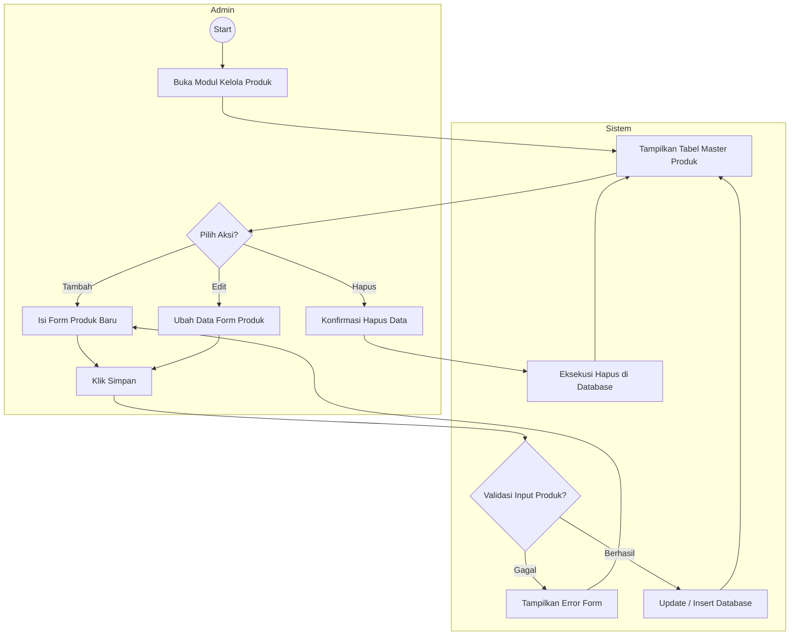

### 8. Activity Diagram: Kelola Template Desain
**Deskripsi Alur:**
*   **Admin:** Menambahkan file *mockup* baju mentahan kosong.
*   **Sistem:** Mengunggah file ke direktori `/public` dan mencatat lokasinya ke tabel `Template`.

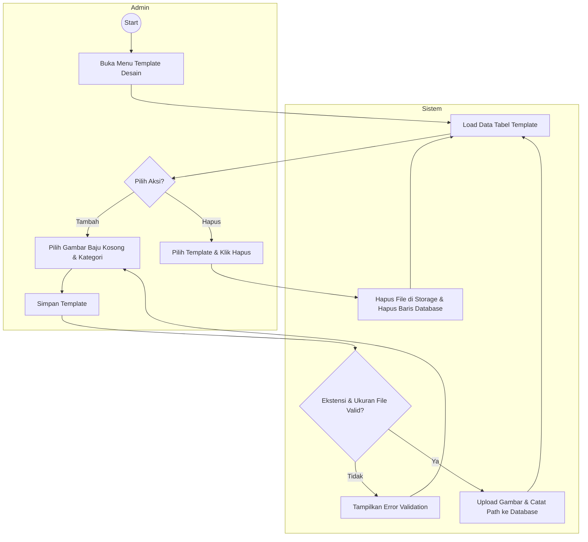

### 9. Activity Diagram: Review Desain Order *(Extend: Beri Catatan Revisi)*
**Deskripsi Alur:**
*   **Admin:** Melihat desain *custom* yang disubmit Customer. Memutuskan apakah kualitas desain bisa dicetak. Jika desain pecah/melanggar aturan, Admin memberi pesan revisi (Extend). Jika aman, lanjut diproses.
*   **Sistem:** Mengubah *Status Desain* di tabel `OrderDetail` dan merekam catatan penolakan ke log/tabel jika terjadi revisi.

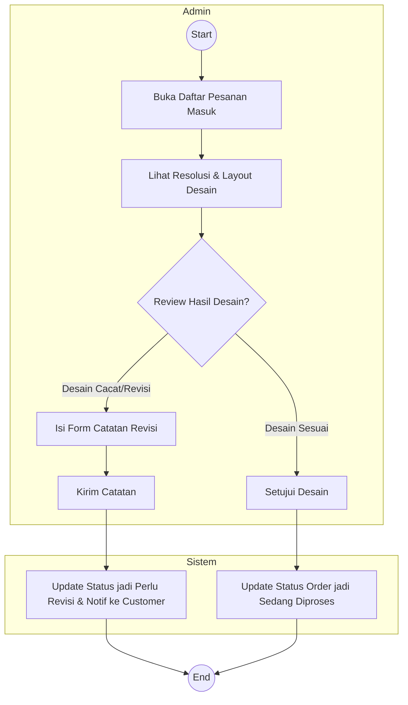

### 10. Activity Diagram: Kelola Pesanan *(Extend: Batalkan Pesanan)*
**Deskripsi Alur:**
*   **Admin:** Memeriksa mutasi bank untuk pesanan baru. Jika transfer palsu atau Customer membatalkan, pesanan ditolak (Extend). Jika benar, masuk ke fase produksi & resi di-input.
*   **Sistem:** Memanajemen perubahan `status_order` hingga order diselesaikan.

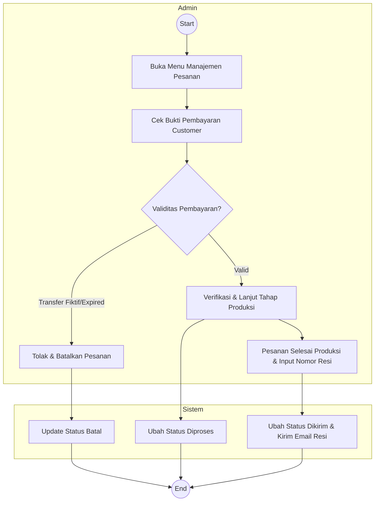

---

## 👔 AKTOR 3: OWNER

### 11. Activity Diagram: Lihat Laporan Penjualan *(Include: Filter Periode)*
**Deskripsi Alur:**
*   **Owner:** Mengecek kinerja bisnis dengan memfilter rentang tanggal (tanggal awal - akhir). Laporan kemudian dapat dicetak (PDF).
*   **Sistem:** Melakukan kalkulasi agregrasi keuntungan (SUM, COUNT) pada tabel `Order` & `OrderDetail` sesuai parameter tanggal.

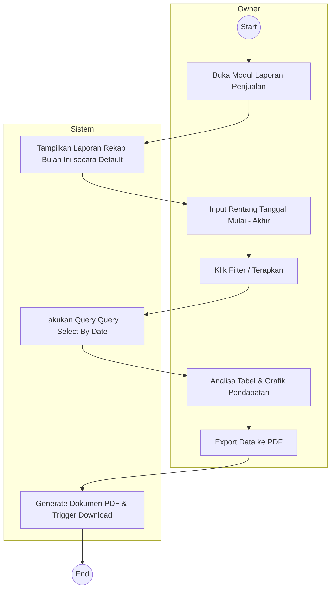
