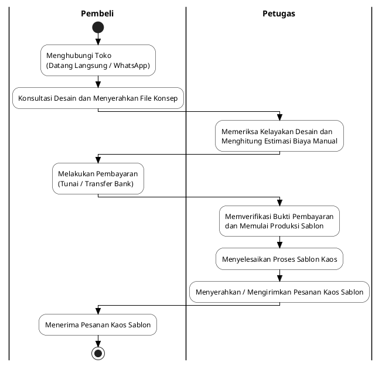

# Analisis Sistem Berjalan: Activity Diagram Pemesanan Sablon (Sistem Lama)

Sistem berjalan pada DAILY.CO menggambarkan proses bisnis pemesanan sablon kaos yang dilakukan secara konvensional atau manual sebelum adanya sistem informasi berbasis web. Proses ini sengaja dirancang sederhana, efisien, dan mencerminkan transaksi nyata di lapangan agar mudah dipahami dalam dokumen skripsi Anda.

---

## 1. Narasi Deskripsi Sistem Berjalan (Manual)

Proses pemesanan sablon kaos secara manual pada DAILY.CO melibatkan dua aktor utama, yaitu **Pembeli** dan **Petugas (Desainer/Kasir)**. Alur kerjanya terbagi menjadi beberapa tahapan berikut:

1. **Tahap Hubungan Awal & Konsultasi:**
   Pembeli menghubungi toko, baik dengan datang langsung ke gerai fisik maupun mengirimkan pesan chat melalui WhatsApp/Instagram. Pembeli melakukan konsultasi mengenai rencana sablon kaos dan menyerahkan file konsep desain (dapat berupa sketsa kasur, file gambar mentah, atau contoh referensi).
   
2. **Tahap Pemeriksaan Desain & Estimasi Biaya:**
   Petugas menerima file konsep desain tersebut, kemudian melakukan pengecekan kualitas dan kelayakan cetak secara manual. Setelah itu, petugas menghitung estimasi total biaya yang harus dibayar pembeli berdasarkan jenis bahan kaos, jumlah pesanan, dan kerumitan desain sablon.
   
3. **Tahap Pembayaran:**
   Pembeli menyetujui rincian biaya yang diajukan dan melakukan transaksi pembayaran. Pembayaran dilakukan secara tunai langsung di toko atau melalui transfer bank, dan pembeli menyerahkan tanda terima pembayaran (bukti transfer) kepada petugas.
   
4. **Tahap Produksi & Sablon:**
   Petugas memverifikasi bukti pembayaran tersebut. Jika dana sudah masuk, petugas memasukkan pesanan ke daftar antrean kerja dan memulai proses produksi pencetakan sablon di atas kaos.
   
5. **Tahap Penyerahan & Penerimaan Kaos:**
   Setelah proses sablon kaos selesai, petugas merapikan produk dan menyiapkannya untuk diserahkan langsung di toko atau dikirimkan ke alamat pembeli menggunakan jasa kurir ekspedisi. Pembeli menerima pesanan kaos sablon tersebut dan transaksi manual selesai.

---

## 2. Hubungan dengan Sistem Usulan (Website Baru)

Sistem usulan (website berbasis web Laravel + Canvas Editor) dirancang khusus untuk memecahkan hambatan dari sistem manual ini dengan memetakan setiap proses di atas ke modul digital:
* **Konsultasi & Penyerahan Desain** digantikan oleh **Fitur Canvas Editor Online** (Pembeli dapat merancang sendiri desainnya di web secara langsung, memilih letak sablon depan/belakang, dan memilih ukuran kaos).
* **Estimasi Biaya Manual** digantikan oleh **Perhitungan Subtotal Otomatis oleh Sistem** (harga kaos + harga jasa sablon langsung dihitung di keranjang belanja).
* **Pembayaran & Verifikasi WhatsApp** digantikan oleh **Halaman Checkout dengan Upload Bukti Pembayaran Mandiri** yang datanya terintegrasi langsung ke dasbor Admin untuk dikonfirmasi.

---

## 3. Kode PlantUML Diagram

Kode berikut disimpan dalam berkas: [activity_diagram_berjalan.puml](file:///c:/laragon/www/percobaanskripsi_1/docs/diagrams/activity_diagram_berjalan.puml)

---

## 4. Berkas Gambar Hasil Kompilasi
Berkas PNG hasil render diagram di atas dapat langsung disalin dari direktori berikut untuk draf Word Anda:
👉 **[activity_diagram_berjalan.png](file:///c:/laragon/www/percobaanskripsi_1/docs/diagrams/activity_diagram_berjalan.png)**
