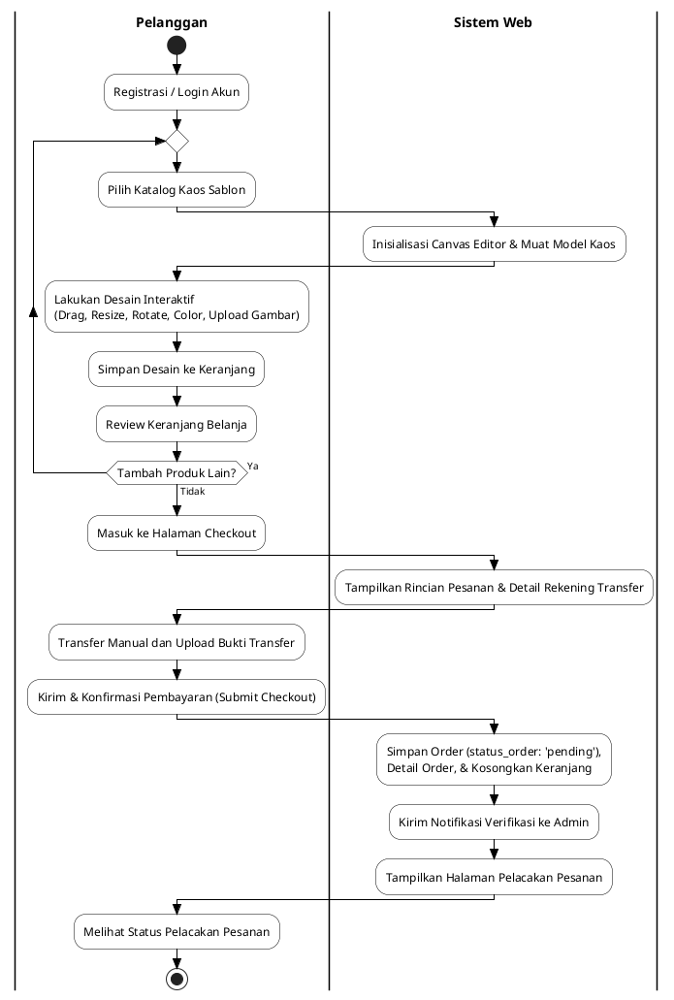

# Analisis Sistem Usulan: Activity Diagram Pemesanan Sablon (Sistem Baru)

Sistem usulan menggambarkan proses bisnis pemesanan sablon kaos berbasis web (Laravel) terintegrasi dengan editor desain interaktif canvas pada DAILY.CO. Berdasarkan analisis kode program aktual pada `CheckoutController` dan struktur view `checkout.index`, terdapat penyesuaian alur agar mencerminkan fungsionalitas program secara nyata.

---

## 1. Analisis Kesesuaian & Perubahan Diagram

Berdasarkan draf diagram usulan awal, terdapat sedikit perbedaan dengan implementasi kode program Laravel saat ini:
* **Draf Awal:** Pelanggan mengirimkan pesanan (*Submit Checkout*) terlebih dahulu, sistem menampilkan nomor rekening, baru kemudian pelanggan melakukan transfer dan mengunggah bukti pembayaran secara terpisah.
* **Implementasi Aktual:** Pada halaman checkout (`customer.checkout.index`), sistem web langsung menampilkan daftar item belanja, subtotal otomatis, nomor rekening transfer bank (BCA), serta formulir untuk mengunggah bukti pembayaran secara bersamaan. Pelanggan melakukan transfer terlebih dahulu, mengunggah berkas bukti transaksi, lalu menekan tombol **"Kirim & Konfirmasi Pembayaran"** untuk mengirim pesanan secara utuh ke database.
* **Perubahan Diagram:** Diagram ini telah diperbaiki sehingga alur transfer manual dan unggah bukti pembayaran diposisikan **di dalam halaman checkout sebelum formulir dikirim**, selaras dengan logika kode `CheckoutController@store`.

---

## 2. Narasi Deskripsi Sistem Usulan (Berbasis Web)

Proses pemesanan sablon kaos berbasis web pada DAILY.CO melibatkan dua entitas utama, yaitu **Pelanggan** dan **Sistem Web**. Alur aktivitasnya dijabarkan sebagai berikut:

1. **Tahap Otentikasi & Pemilihan Produk:**
   Pelanggan melakukan registrasi akun (jika belum memiliki akun) atau login ke dalam sistem web. Setelah masuk, pelanggan membuka katalog produk kaos sablon untuk memulai pemesanan.
   
2. **Tahap Desain Interaktif (Canvas Editor):**
   Saat memilih produk, sistem menginisialisasi modul *Canvas Editor* dan memuat model mockup kaos (tampak depan dan tampak belakang) secara dinamis. Pelanggan merancang desainnya secara interaktif menggunakan fitur manipulasi gambar (seperti geser/drag, ubah ukuran/resize, putar/rotate, ganti warna kaos, atau unggah gambar custom). Desain yang sudah selesai disimpan langsung ke dalam keranjang belanja.
   
3. **Tahap Evaluasi Keranjang (Looping):**
   Pelanggan meninjau isi keranjang belanja. Sistem memberikan pilihan keputusan: apakah pelanggan ingin memesan produk sablon lain (kembali ke katalog) atau melanjutkan transaksi ke checkout.
   
4. **Tahap Checkout & Pembayaran Terpadu:**
   Ketika pelanggan masuk ke halaman checkout, sistem web langsung menyajikan ringkasan total tagihan beserta detail nomor rekening transfer bank. Pelanggan mentransfer total dana secara manual melalui mobile banking/ATM, mengunggah foto bukti transfer pada kolom yang disediakan, dan mengirimkan formulir checkout.
   
5. **Tahap Penyimpanan Data & Pelacakan:**
   Sistem web menerima data checkout, mengunggah berkas bukti transfer ke penyimpanan server, menyimpan record transaksi ke database dengan status order awal `'pending'`, serta otomatis mengosongkan isi keranjang belanja pelanggan. Sistem kemudian mengirim notifikasi verifikasi ke admin dan mengarahkan halaman pelanggan ke dasbor pelacakan (*tracking*). Pelanggan dapat memantau perkembangan status verifikasi dan produksi sablon kaosnya secara real-time.

---

## 3. Kode PlantUML Diagram

Kode diagram usulan disimpan dalam berkas: [activity_diagram_usulan.puml](file:///c:/laragon/www/percobaanskripsi_1/docs/diagrams/activity_diagram_usulan.puml)

---

## 4. Berkas Gambar Hasil Kompilasi
Berkas PNG hasil render diagram usulan sistem baru dapat disalin dari direktori berikut untuk draf Word Anda:
👉 **[activity_diagram_usulan.png](file:///c:/laragon/www/percobaanskripsi_1/docs/diagrams/activity_diagram_usulan.png)**
